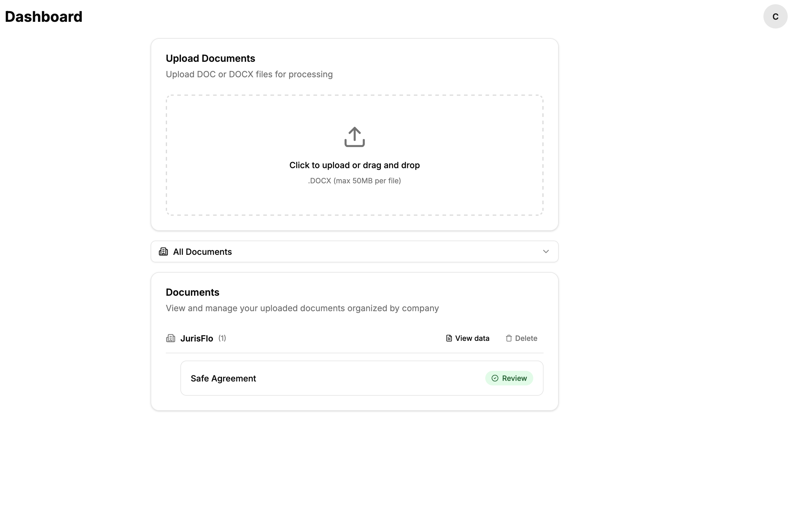
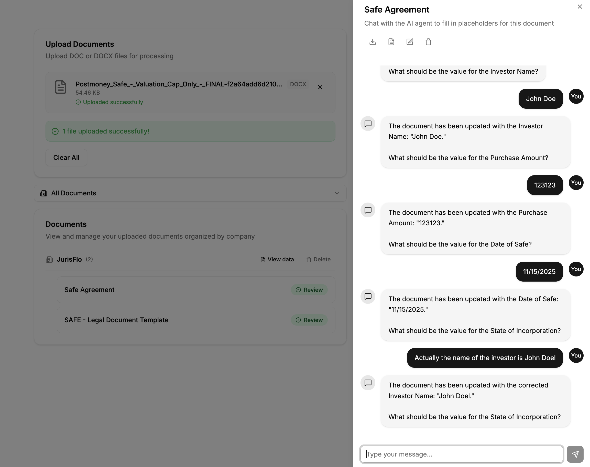
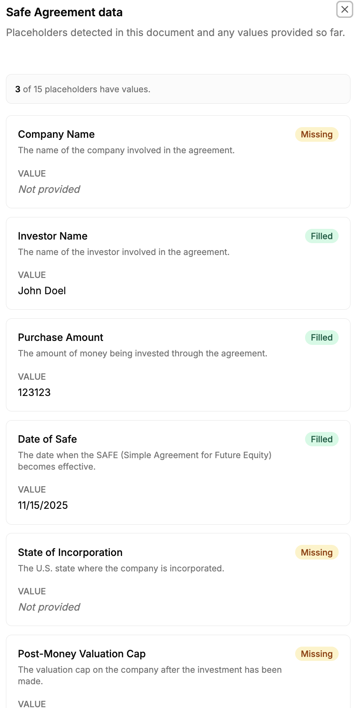

# JurisFlo

A simple web app for intelligently parsing company documents and filling dynamic placeholders through an agentic chat.
Leverages OpenAI's API and Convex's AI Agent workflows to provide a streamlined experience.

Other features include an account system, automatic company data recognition, and smart back-filling.

*This example project is not complete and the prompts / model choice could use some work.*

### Screenshots

